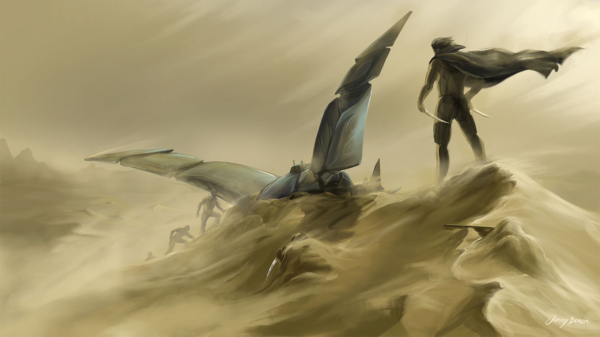
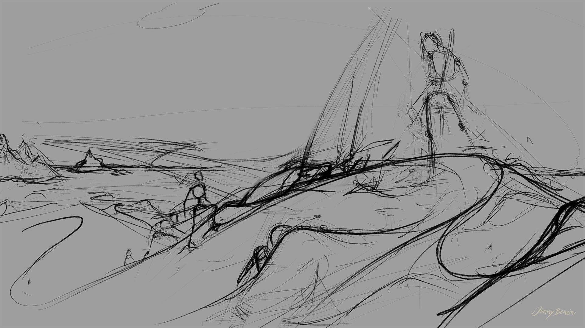

Paul encounters Gurney.

Frank Herberts "Dune" Series is, in my opinion, the by far most fascinating sci-fi story ever written. Since the age of about 13, I have read the complete series over and over again. This is from the first part, when Paul meets Gurney after having become a Fremen.

