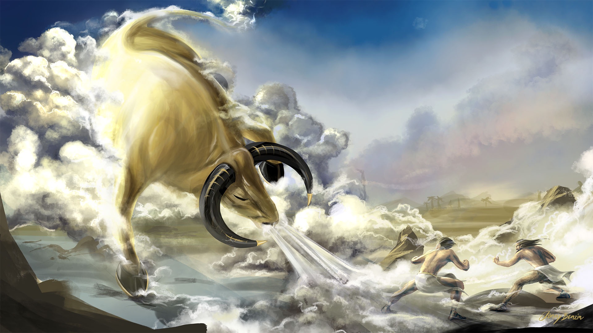
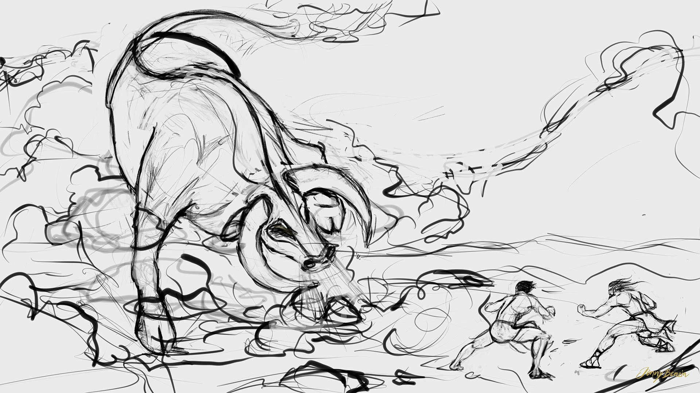

A scene from the Epic of Gilgamesh, a mesopotamian poem more than 3800 years old. King Gilgamesh and his friend Enkidu slay the Bull of Heaven and arouse the wrath of the gods.

Gilgamesh and Enkidu slaying the bull of heaven.

rough sketch
