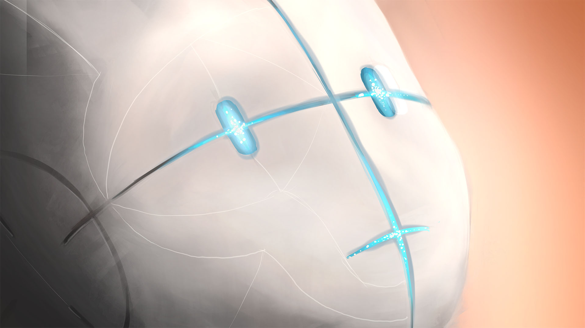
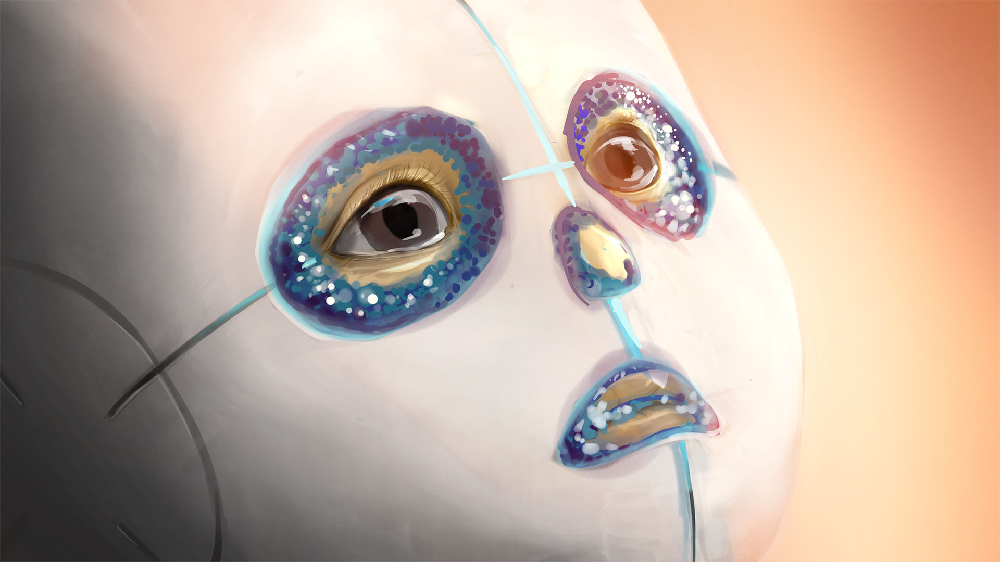

The „You and I“ protagonist is protected by a suit based on the physics of planck plasmatic modifications. It is therefor capable to fully shield its interior from any outside physical influence. It can also manipulate electromagnetic patterns and chemical processes in a certain perimeter around the suit. The suit is controlled by a level 6 artificial intelligence with the sole objective to keep its interior alive.

The intelligent suit.

Its safe.

A new world.
