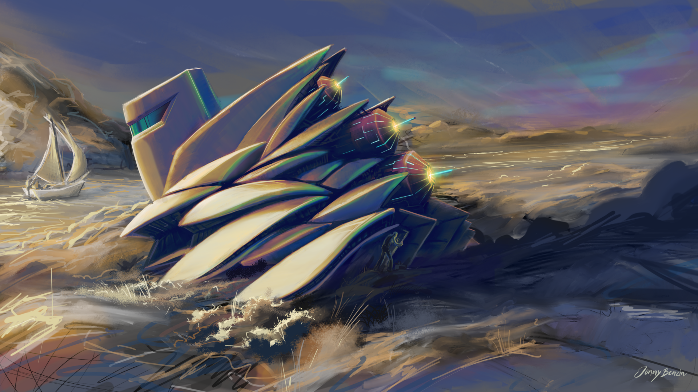
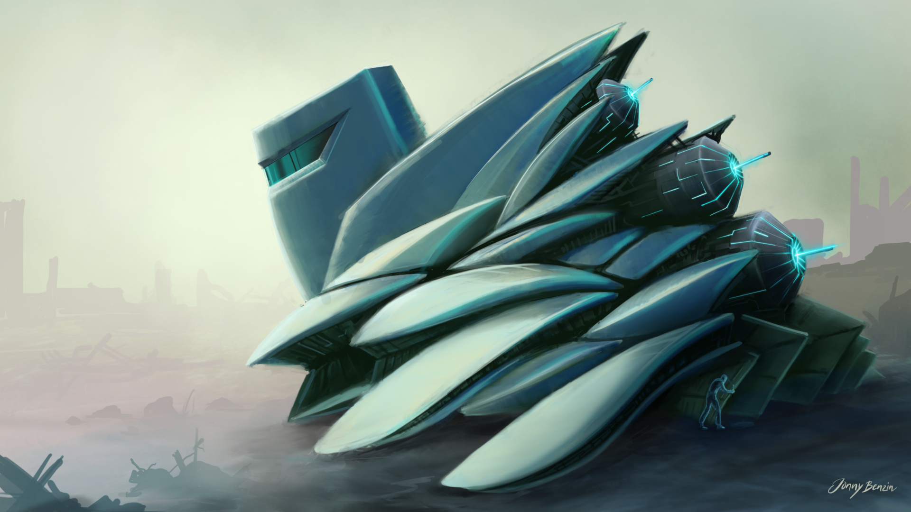

The weekend at his sommarstuga near Björholmen is drawing to a close. Mahmud quickly verifies the energy configuration before departure. Tomorrow, he'll be back in his laboratory on Canopus II.

final version

## 

The first version set in a post apocalyptic scenario.
