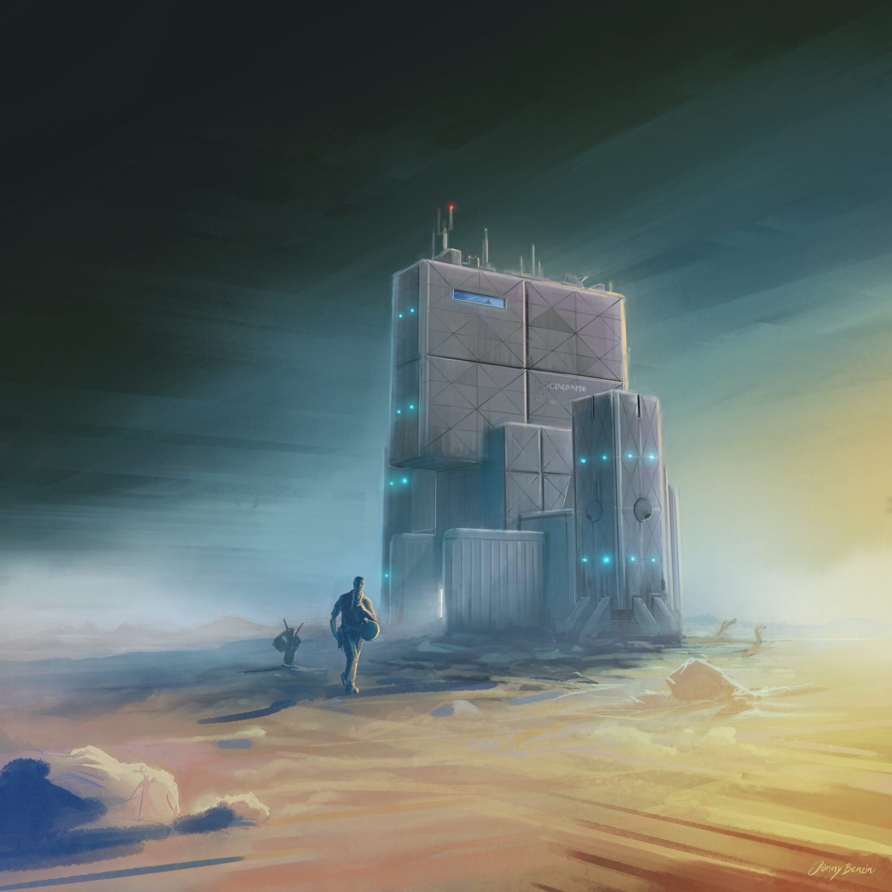

The Rocinante touches down on Ilus/New Terra, depositing Jim Holden and Amos Burton for their crucial mission to mediate between colonists and the RCE. This scene unfolds in 'Cibola Burn,' the fourth installment of 'The Expanse' book series.

Jim Holden and Amos Burton dropped off for the Ilus mission.

The ROCINANTE III - 16:9

The ROCINANTE III - 9:16
