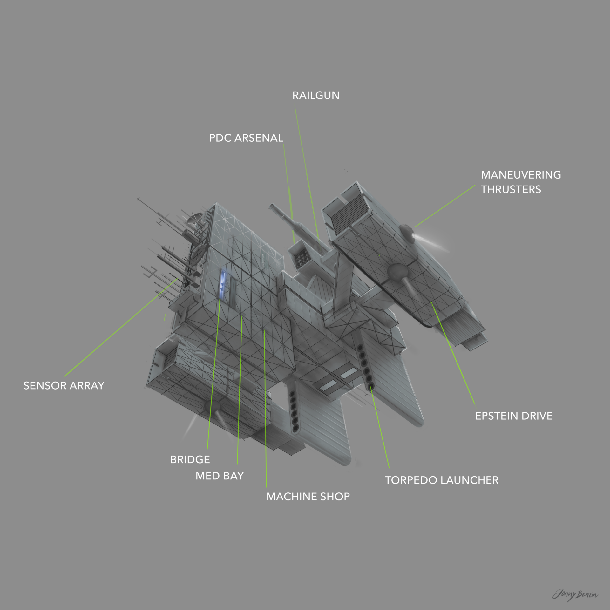

This is how I imagine the spaceship "Rocinante" from James Corey’s "The Expanse" book series. A boxy and brutalistic piece of space vessel.

The ROCINANTE hovering over Jupiter moon Europa. Version 2.

Version 1.

The ROCINANTE from James Corey’s ‘The Expanse’ series as imagined by Jonny Benzin.
