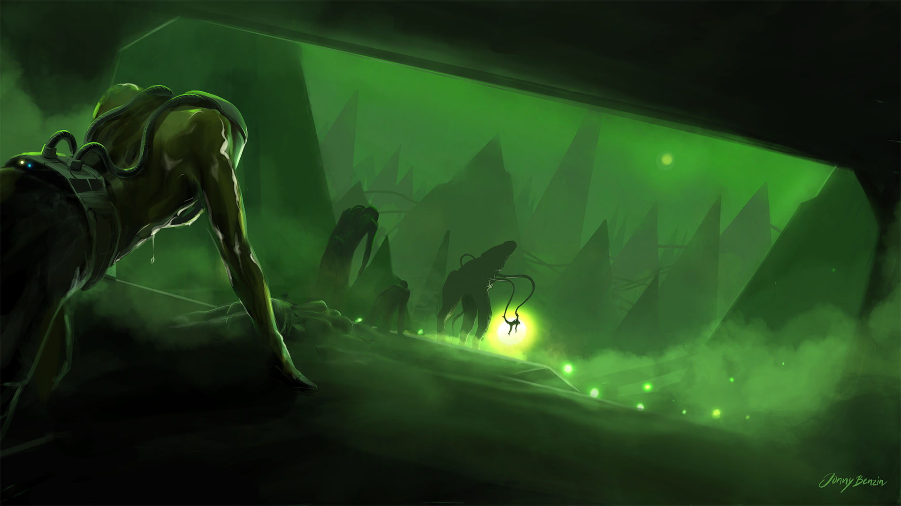
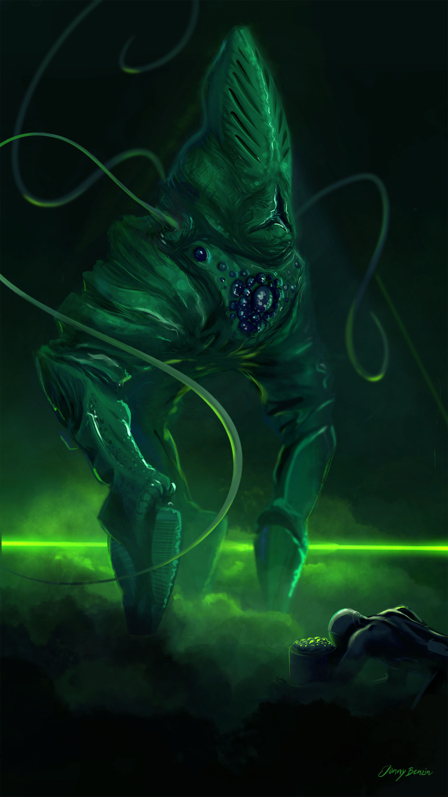

I read John Christophers tripods trilogy for the first time at the age of 12. The moment when the protagonist enters the city of gold and lead is just unforgettable. Although it appeared somewhat outdated when I read it last year, I do really like the ideas and the story.

Welcome to the city of gold and lead.

Master and slave.

.

.
