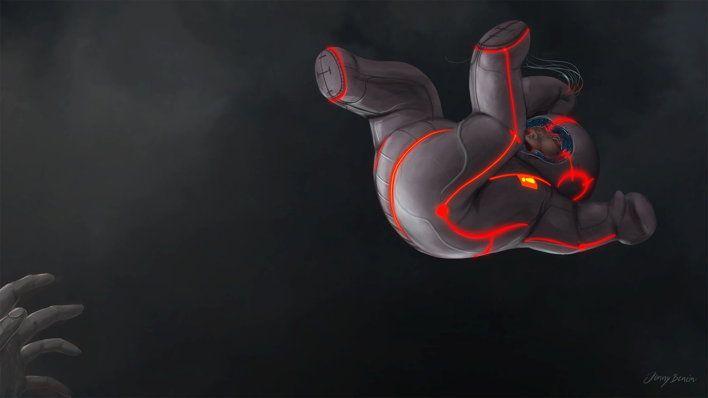
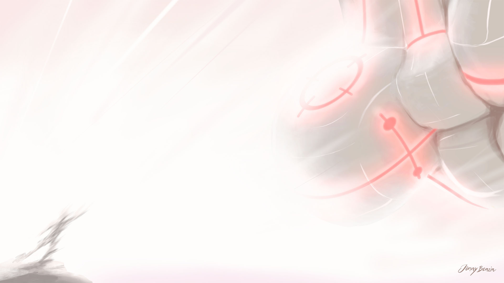
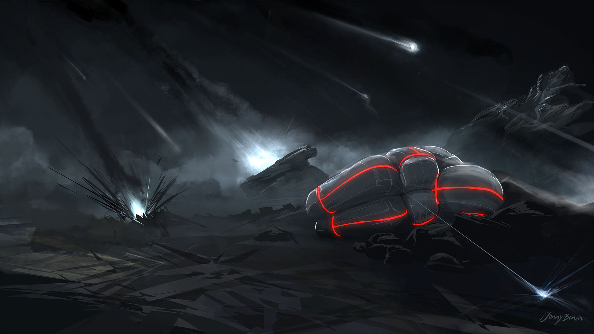
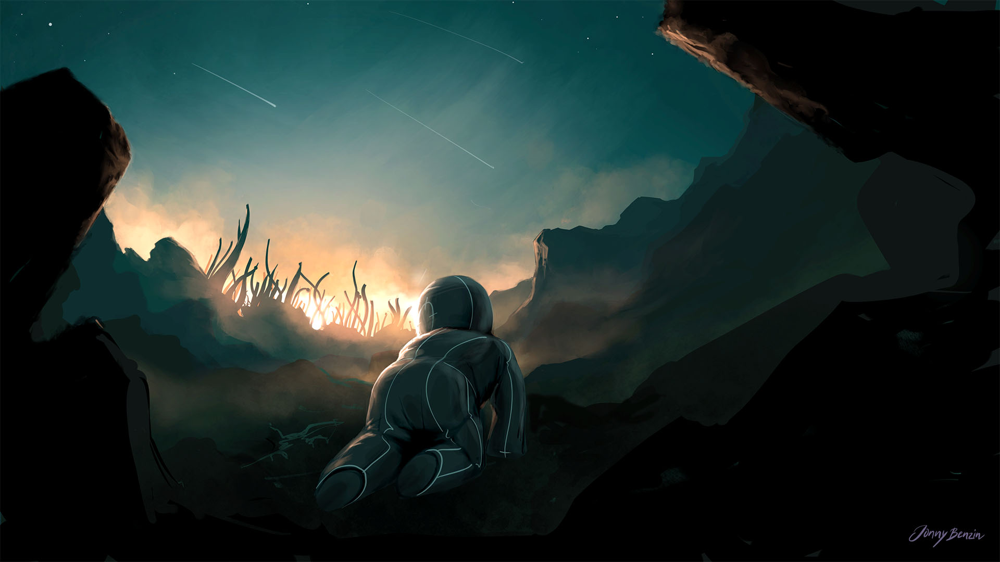
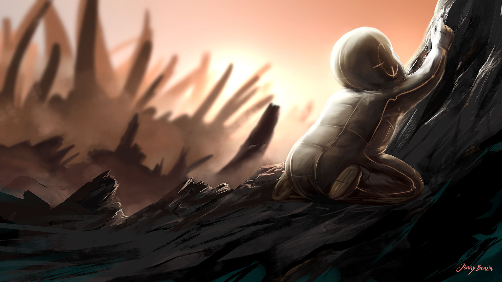
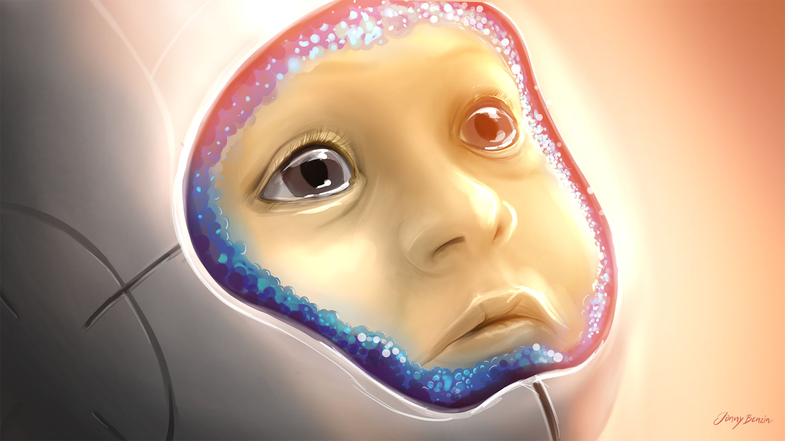
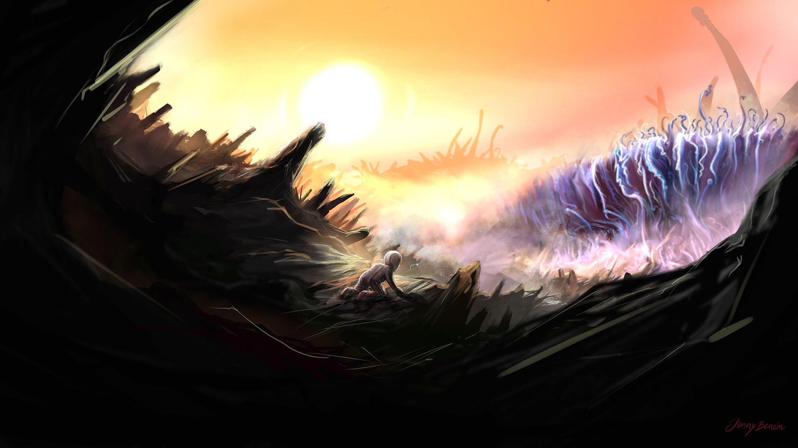
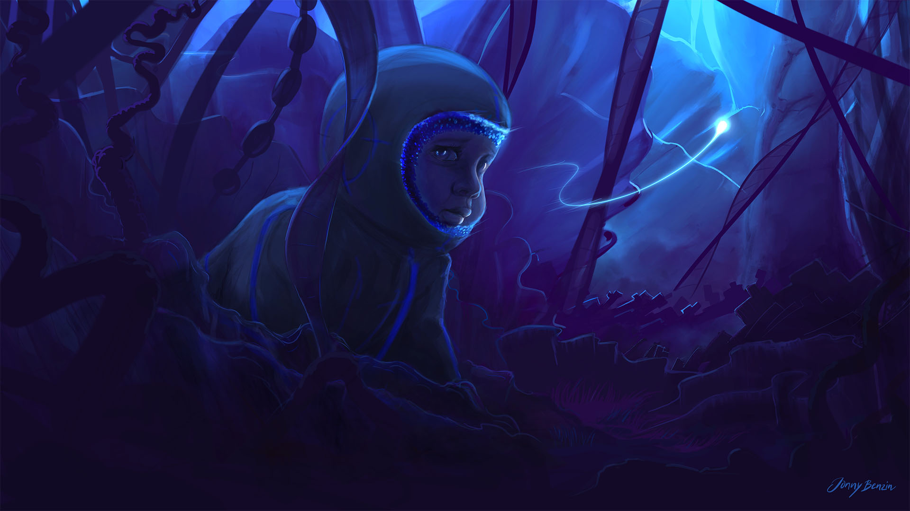
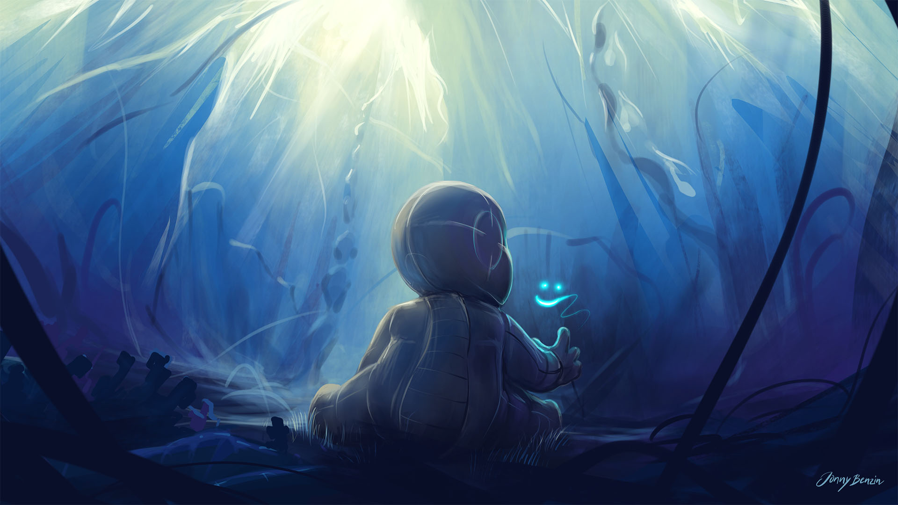

A 14 months old infant, the sole survivor of spaceship disaster, is left stranded on an alien planet accompanied only by the level 6 artificial intelligence within the protective suit. The infant and the ai form a symbiotic relationship, both trying to make sense of their destiny and learning to find a way through the strange world they’ve been thrown into.

Detonation -0:02, final execution..

Detonation -0:01

Detonation 0:00

Detonation +0:17

A place to go?

Sensing safety.

A new world.

The right direction.

Entering the organism.

Inside the organism.
